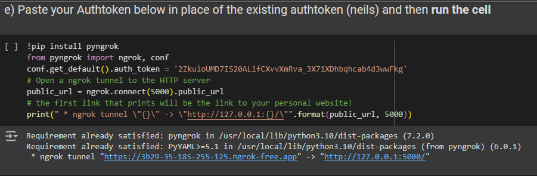

# Agricultural Assistant Chatbot
## Overview
Welcome to the Agricultural Chatbot! This application is designed to assist farmers, agronomists, and agricultural enthusiasts by providing information and support on various agricultural topics. The chatbot can answer questions, provide tips, and help with common agricultural tasks.
## Features
1. <strong>Real-time Assistance:</strong> Get instant responses to your agricultural queries.
2. <strong>Wide Range of Topics:</strong> Covers topics such as crop management, pest control, soil health, weather forecasts, and more.
3. <strong>User-Friendly Interface:</strong> Easy to use with a simple and intuitive interface.
4. <strong>24/7 Availability:</strong> Access the chatbot anytime, anywhere.
## Usage
Open the notebook in google colab and run it.

 
From the above example, click on the ngrok url uniquely generated for you where you will be able to access the chatbot

# Contibutors
Bob Hawkins 
Silas Mutugwa 
Jones Alukwe
